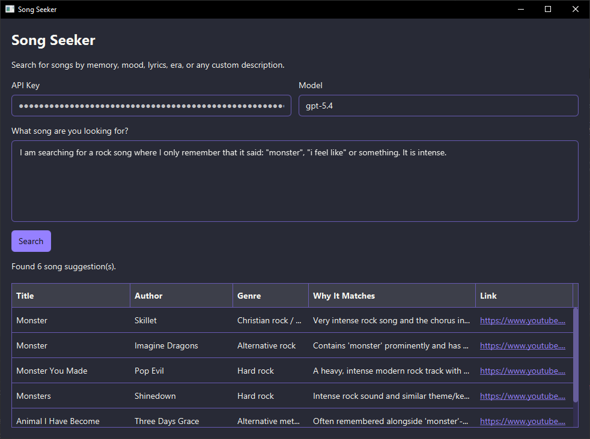

# Song Seeker

A basic demo app for education purposes how to integrate ChatGPT API into a client application.



## Run

To build and run this app yourself, you need Java Development Kit (JDK) **25**.
[Amazon Corretto 25](https://github.com/corretto/corretto-25/releases/tag/25.0.3.9.1) is a good choice.

```
JAVA_HOME=/path/to/jdk-25 ./gradlew run
```

For Windows, you can download a prebuilt executable that you can easily execute without any JDK installation:
[SongSeeker-Windows-portable.zip](https://github.com/Dansoftowner/song-seeker/releases/download/1.0.0/SongSeeker-Windows-portable.zip).